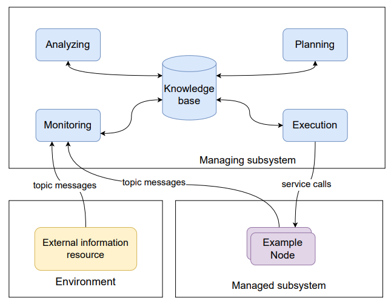
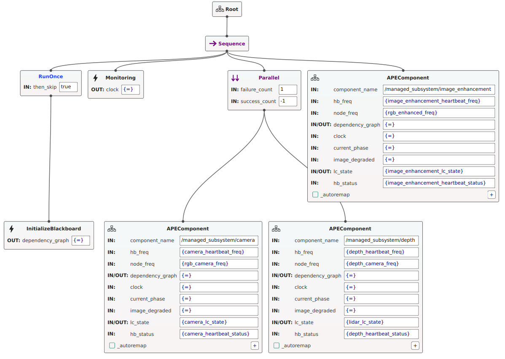
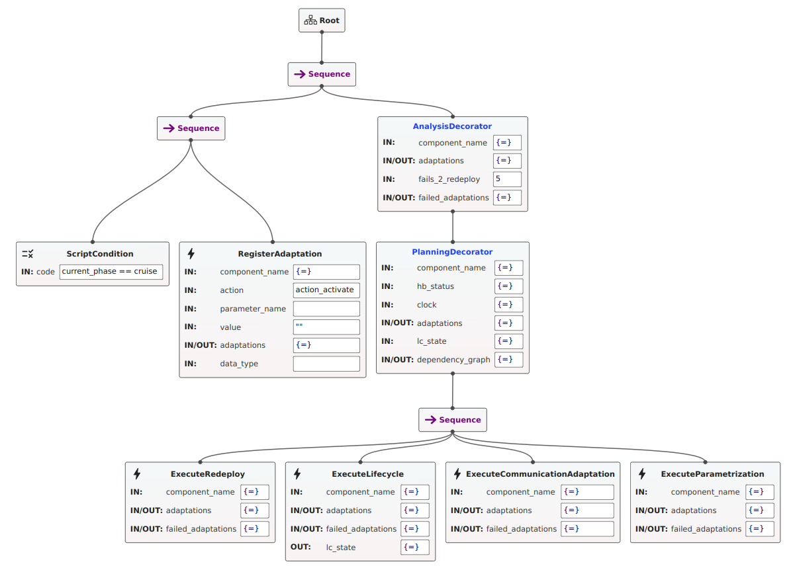

# Combining Quality of Service and System Health Metrics in MAPE-K based ROS Systems through Behavior Trees
[](https://gitlab.xitaso.com/engl/mapek-bt/-/commits/main)





# Getting started

[[_TOC_]]

## Requirements

- Docker (necessary)
- CUDA (optional if you want to run the segmentation models in the managed subsystem on the GPU)

## Additional data

Download the segmentation models and the ros bags with test data from the a server with the scp command (password `acsos`):

```bash
scp acsos@135.181.254.26:/mapek-bt/data.zip .
```

Unzip and place it inside the ros_ws as a ".data" folder.

```
ros_ws
├── .data
│   ├── chckpoints
│   │   ├── depth.pth
│   │   ├── fusion.pth
│   │   └── rgb.pth
│   └── SynDrone_t01_h50.bag
```

## Replication of our results

Run the experiment from the root of the repository with 

```bash
bash ./ros_ws/evaluation/run_multi_experiment.sh
```
The logs will be stored in a folder `log_dump` next to the ros_ws directory.

## Evaluation of log files
To calculate the results in our table, for each table there are scripts in the [experiment_setup folder](./ros_ws/src/experiment_setup/experiment_setup/)
To retrieve our log files you can get them from the same server as above:

```bash
scp acsos@135.181.254.26:/mapek-bt/logs.zip .
```

Unzip this file and place it in the ros_ws folder. You should have the following directory structure:
```
├── main
│   ├── scenario_empty_activation_rules
│   ├── scenario_empty_full_rules
│   ├── scenario_F1+S1_activation_rules
│   ├── scenario_F1+S1_full_rules
│   ├── scenario_image_degradation_activation_rules
│   ├── scenario_image_degradation_full_rules
│   ├── scenario_message_drop_activation_rules
│   └── scenario_message_drop_full_rules
└── wo_dep_logs
    ├── scenario_image_degradation_full_rules
    └── scenario_message_drop_full_rules
```

Now you can run the eval scripts to get the results in our paper.
For Table 1, [this script](./ros_ws/src/experiment_setup/experiment_setup/eval_exp1.py) calculates the results.
For Table 2, [this script](./ros_ws/src/experiment_setup/experiment_setup/eval_exp2.py) calculates the results.
For Table 3, [this script](./ros_ws/src/experiment_setup/experiment_setup/eval_exp3.py) calculates the results.

## Development

There is a devcontainer file, i.e. you can just open VSCode in the root of this repository and reopen VSCode in the devcontainer.
This should do the rest.

In case you want to visualize the Behaviour Tree that will be run, install [Groot2](https://www.behaviortree.dev/groot/) whereever you like. 
Live visualization is only available in the Pro Version of Groot2 anyway, so we don't bother with that.

# Structure of the repo

Everything important is in the ros_ws. Here you find the following packages:

- bt_mape_k
- engel_interfaces
- managed_subsystem
- python_base_class

## BT_MAPE_K

This package contains the implementation of the Behaviour Tree. 
The [bt_exectutor](ros_ws/src/bt_mape_k/src/bt_executor.cpp) is responsible for building the BT and executing it.
The implementation of the nodes is in the [include](ros_ws/src/bt_mape_k/include/bt_mape_k) directory and in the according src files.

All BTs we develop in this paper can be stored in the [bts](ros_ws/src/bt_mape_k/bts) directory.

## system_interfaces

This package contains all custom interfaces that we need in order to implement the MAPE-K loop.

## Script Code with memory

If you want to describe a rule in the Behaviour Tree and do not want to condition to be triggered everytime but only on change, you can use the newly created ScriptCodeWithMemory node.
You can use it exactly same as the "normal" ScriptCondition implemented in BehaviourTreeCPP. It is just extended with a memory, i.e. it remembers if it was already true/false in the last tick and therefore only gets triggered on change.

## Managed Subsystem

This package contains the full managed subsystem.

### Camera node

The camera node can artificially degrade the incoming image from the rosbag by shifting it towards a darker spectrum.

Use the parameter `image_degradation` to set the degradiation from `0.0=no degradation` to `1.0=maximum degradation`.

### Depth node

The depth node can artificially degrades the incoming depth by adding noise to simulate unreasonable data at higher altitudes.

Use the parameter `depth_degradation` to set the degradiation from `0.0=no degradation` to `1.0=maximum degradation`.

### Image enhancement node

The image enhancement node tries to reverses the image shift by normalizing the image mean and standard deviation to a constant value.

### Sensor fusion node

The sensor fusion node synchronizes the data streams from the camera, lidar and enhancement.

Use the parameter `topic_camera_input` to set the rgb input to either `/rgb_camera` or `/rgb_enhanced`.

Use the parameter `modality` to set the fusion to `0=fusion`, `1=rgb` or `2=depth`.

### Segmentation node

The Segmentation node takes the fused data as input and outputs a predicted segmentation.

## Experiment setup

This package contains all logic that is necessary for running a full experiment.

Use `ros2 launch experiment_setup experiment.launch.py` to run the full managed subsystem and all evaluation nodes.

The ros bag needs to be started seperately with `ros2 bag play .data/SynDrone_t01_h50.bag --clock`. Make sure to choose the `Dockerfile.cuda` in the devcontainer configuration when using a GPU. Note the `--clock` flag which is necessary to sync the time of the system with the ros bag time in combination with the `use_sim_time=true` flag for all nodes.

### Evaluator

This node will compare the ground truth segmentation with the segmentation generated by the system. The results are directly logged via a [logger](./ros_ws/src/experiment_setup/experiment_setup/experiment_logger.py) that writes the results into a csv.

### Message dropper

This node implements an additional message republishing step for all intermediate data streams. It can be used to strategically drop messages during the experiment execution.

Set the parameter `do_drop_<topic_name> = True` to drop a specific topic until the param is set to false again.

### Scenario executor

This node will create specific failure scenarios based on a yaml file.

See `ros_ws/src/experiment_setup/resources/scenarios` for example uses and required keys for each event type.

## Python Base class

This package contains the base class that will be used by every node in the managed subsystem.
For examples how to use the base class follow the instructions in the next section.

# Configuration

## Behavior Tree configuration

Next there is an explanation of all the ports that are necessary to understand in order to build a behavior tree. First this covers the main behavior tree and second the subtree responsible for a single ROS node in the managed subsystem.
In General, all ports with a {=} value, do not have to be configured, they will be filled by the nodes itself.

### Main Behavior Tree


In this image you can see a simpler version of the main behavior tree .

The _InitializeBlackboard_ node is responsible for filling the blackboard with initial values. 
This includes variables that are used in the rules for evaluating the state of the managed subsystem but also the dependency graph.
All values that should be present from the first tick on are stored in [here](./ros_ws/src/bt_mape_k/bts/init_blackboard.json).
This is needed since the BT may tick through all the rules that want to read values from the blackboard before the information from the managed subsystem are present.

The monitoring node works as described in the paper and writes the current time in the ROS system on the blackboard.
It receives the messages what to write onto the blackboard from the [blackboard setter](./ros_ws/src/managed_subsystem/managed_subsystem/blackboard_setter.py) which sends a list of key value pairs (implemented as parameters) to the monitoring node. 
The name of the parameter will be the key under which the value of the parameter will be stored in the blackboard.

The subtrees need to be configured when implementing this BT for a new managed subsystem or in case the managed subsystem is modified.

Necessary ports for the subtree:
- component_name: exact name of the ROS node (namespace + name)
- dependency_graph: Is configures in the InitializeBlackboard BT node. Apart from that no configuration needed
- clock: Current time; will be filled by Monitoring node, so no configuration needed
- lc_state (lifecycle_state of this node): Will be filled initially by the InitializeBlackboard node with the value described in [here](./ros_ws/src/bt_mape_k/bts/init_blackboard.json). After that the executeLifecycle node in the respective subtree fills the new lifecycle state as soon as there is a response when activating / deactivating a node

The other ports are used because these are information that we collect in the managed subsystem and use them in the [rules](./ros_ws/src/bt_mape_k/bts/full_rules.txt) we define for our experiments.


### ROS Node specific subtree



The subtree in prinicple can have any design you like with a few "best practices". 
- If you want to include the dependency_graph, you will need the _PlanningDecorator_ as parent of the execution node sequence
- If you want to use rules from the DSL, you have to use the AnalysisDecorator (see below)

If you want to define the rules with BT nodes you can use sequences.
Therefore, add a ScriptCondition or [ScriptConditionMemory](./ros_ws/src/bt_mape_k/include/bt_mape_k/script_condition_memory.hpp) in which a condition for a rule is defined.
The ScriptConditionWithMemory only triggers when the condition changes.
Next add a _RegisterAdaptation_ which will put an adaptation into a queue with potential adaptations that could be executed.
Therefore, define an action which can have the values (action_activate, action_deactivate, action_restart, action_redeploy, action_change_communication, action_set_parameter). 

Difference between restart and redeploy:
- Restart: Deactivates and activates a node
- Redeploy: Kill a node completely and relaunch it

For the actions action_activate, action_deactivate, action_restart, action_redeploy the fields parameter_name and value can be left empty.

For the other actions the parameter_name as configured for the ROS node and the value of the parameter have to be provided.
For robustness, you can also provide the datatype of the parameter value.
Possible values are string, bool, double, int.

The only other port you can configure is in the AnalysisDecorator:
fails_2_redeploy in the AnalysisDecorator: If a specific adaptation fails for a few times (the amount you specify in this port), the node will be redeployed.


### Rules for adaptation

Current approach for designing a domain specific language for rule definition:

```
BEGIN CONSTS
    int const_flight_phase_not_set 0
    int const_flight_phase_cruise 1
    int const_flight_phase_descent 2
    int const_flight_phase_approach 3
    int const_flight_phase_final_approach 4
    int const_flight_phase_landing 5
    string topic_camera_input topic_camera_input
    bool const_true true
    bool const_false false
    int modality_fusion 0
    int modality_rgb 1
    string enhanced_rgb_topic /rgb_enhanced
    string raw_rgb_topic /rgb_camera
    double hb_freq_min 5.0
    double node_freq_min 5.0
END CONSTS

BEGIN RULES
    RULE init_sensor_fusion ON_TRIGGER_CHANGE
    COMPONENTS [/managed_subsystem/sensor_fusion]
    IF (current_phase == const_flight_phase_cruise)
    THEN action_set_parameter modality modality_rgb

    RULE activate_base_system ON_EVERY_TRIGGER
    COMPONENTS [/managed_subsystem/camera, /managed_subsystem/sensor_fusion, /managed_subsystem/segmentation]
    IF (current_phase == const_flight_phase_cruise)
    THEN action_activate
    
    RULE activate_base_system ON_EVERY_TRIGGER
    COMPONENTS [/managed_subsystem/camera, /managed_subsystem/sensor_fusion, /managed_subsystem/segmentation]
    IF (current_phase == const_flight_phase_descent)
    THEN action_activate
END RULES
```

All the variables used in the conditions have to be readable from the blackboard (either blackboard setter sends this values to the BT or you define them via constants)

# Use of base class
## Communication configuration

An example on how to configure the communication for your node is shown in [here](./ros_ws/src/managed_subsystem/managed_subsystem/config/camera_config.py)

The following is a more extensive example showcasing a configuration for each communication possibility supported by the base class.

```python
from python_base_class.node_config import CommunicationTypes
from std_msgs.msg import String
from std_srvs.srv import SetBool

comm_types = [
    {
        "comm_type": CommunicationTypes.PUBLISHER,
        "name": "/example_ns2/example_name",
        "msg_type": String,
        "time_period": 0.5,
        "callback": "publisher_callback",
        "always_on": False
    },
    {
        "comm_type": CommunicationTypes.PUBLISHER,
        "name": "/example_ns2/publisher_wo_callback",
        "msg_type": String,
        "always_on": False
    },
    {
        "comm_type": CommunicationTypes.SUBSCRIPTION,
        "name": "/example_ns/example_name",
        "msg_type": String,
        "callback": "subscription_callback",
        "always_on": False
    },
    {
        "comm_type": CommunicationTypes.SERVICE,
        "name": "/example_ns/service",
        "srv_type": SetBool,
        "callback": "service_callback",
        "always_on": False
    },
    {
        "comm_type": CommunicationTypes.SERVICE_CLIENT,
        "name": "/example_ns/service_2",
        "srv_type": SetBool,
        "always_on": False
    },
]
```
This example dictionary also specifies exactly how a config has to look like. Each key is necessary and will also be validated by the base class.
If there is a typo or a key missing, the base class will throw an error.
If configuring a publisher, you can choose between using a timer or publishing the data in whatever way you prefer as seen in the example above.
In case you need a callback for the communication way, the name of the callback in the configuration has to match exactly the name of the function that you define in your node.
If you want that your communication is always available (ONLY IN RARE CASES!), you can set the `always_on` parameter to True.


## Parameter configuration

For parameters there is a central config file that is built like parameter files are usually used in ROS2 (see [ROS2 documentation](https://roboticsbackend.com/ros2-yaml-params/))

Imagine the params.yaml file looks like this:

```yaml
camera_node:
  ros__parameters:
    param1: 2.3
    topic_test_input: ''

lidar_node:
  ros__parameters:
    param2: 1

sensor_fusion:
  ros__parameters:
    topic_camera_input: "camera_raw"
```

There are two types of parameters:
- describing a value that you can use in your algorithms that should be adaptable, e.g. a confidence threshold in your object detection model.
If you adapt a parameter here, the respective class member variable will be changed to the new value, i.e. the name of the parameter has to match the name of the member variable
- describing a communication interface, e.g. which topic to listen to if you want to have camera images. If you adapt this kind of parameter, the 
respective communication interface will be changed. To which communication interface a parameter refers, is defined in the communication configuration with the key "param".

Currently the difference between these two parameters is detected by the name, i.e. if the substring "topic" is in the parameter name, it will be handled as communication change,
otherwise only the class member variable will be changed.

You are implementing the camera_node e.g. like this:

```python
import rclpy
from typing import List
import rclpy.parameter
from sensor_msgs.msg import Image

from python_base_class.engel_base_class import ENGELBaseClass
from managed_subsystem.config.camera_config import comm_types

from ament_index_python.packages import get_package_share_directory
import os


class CameraNode(ENGELBaseClass):
    def __init__(
        self,
        comm_types: List,
        node_name: str = "camera_node",
        param_file: str = "params.yaml",
    ):
        config_file = os.path.join(
            get_package_share_directory("managed_subsystem"), "config", param_file
        )
        super().__init__(node_name, comm_types, config_file)

        
        self.param1 = None # instantiating a class member variable that will be filled with value by the parameters
        self.topic_test_input = None

        self.trigger_configure()
        self.trigger_activate()
        if self.validate_parameters() is False:
            self.logger.warn(
                f"Not all parameters are initialized correctly. Every parameter in \
                    the params.yaml file has to be a class member of {self.get_name()}"
            )
        
    def publisher_callback(self):
        msg = Image()
        publisher = self.get_comm_object("/camera_raw")
        msg.header.frame_id = "/camera_raw"
        msg.header.stamp = self.get_clock().now().to_msg()
        publisher.publish(msg)

    def subscription_callback(self, msg: Image):
        pass
```

with your communication configuration looking like this:

```python
from python_base_class.node_config import CommunicationTypes
from sensor_msgs.msg import Image

comm_types = [
    {
        "comm_type": CommunicationTypes.PUBLISHER,
        "name": "/camera_raw",
        "msg_type": Image,
        "time_period": 0.5,
        "callback": "publisher_callback",
        "always_on": False,
    },
    {
        "comm_type": CommunicationTypes.SUBSCRIPTION,
        "name": "/test_img",
        "msg_type": Image,
        "callback": "subscription_callback",
        "always_on": False,
        'param': 'topic_test_input',
    }
]
```

The following things have to be considered now:
- the name of the node (specified in your CameraNode class constructor) has to match one entry in the params.yaml file that describes the parameters used for this node.
- there has to be a class member variable with the same name as the parameter
- The handling of the parameters happens in the base class
- At the end of the constructor you can validate the parameters with the self.validate_parameters function. This will log a warning if there is something wrong.
